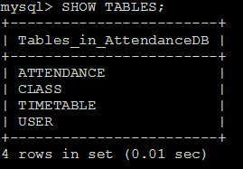
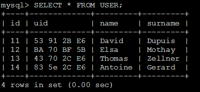
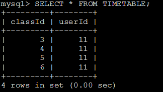
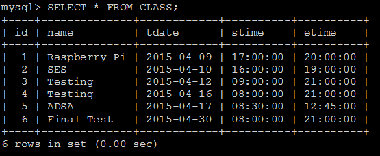
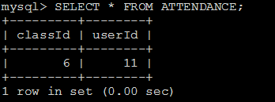
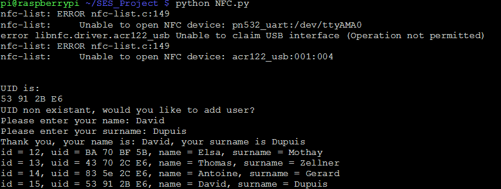
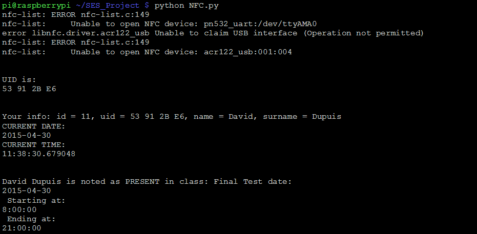

# NFCAttendanceLogger

Our project report, written in English, is available at: [PDF Project Report](https://github.com/davidcdupuis/nfcattendancelogger/blob/master/%5BSES%5D%5BCLASS%20PROJECT%5DDUPUIS%26ZELLNER.pdf).

## Objective

Use NFC card reader to manage student class attendance.

## Description

This was a university project. The purpose was to build a project with a Raspberry Pi. At my engineering university we used student cards to get inside the school and pay for things.

Back then attendance was taken by having students sign a piece of paper. It was easy for students to cheat the system by signing for friends which would first force the teacher to lose precious time counting all students and eventually calling every student by name.

To prevent students from cheating and time being wasted, my idea was to simply monitor student attendance by having students scan their student cards at the beginning and eventually the end of the class to indicate that they had attended.

## Implementation

My friend  (Thomas Zellner) and I used a Raspberry Pi 2 and a USB NFC u122c card reader to read and store the unique student key on the card.

### Database

We set up a SQL database on the PI to store the necessary information. We set up four tables: *ATTENDANCE*, *CLASS*, *TIMETABLE* and *USER*. (see <a href="#fig-1">Fig 1.</a>)

<figure id="fig-1" class="image" style="text-align:center">
  
  <figcaption >Fig 1. - SQL Tables</figcaption>
</figure>

We instantiated a *USER* table with four users and their respective UIDs on their badges. (see <a href="#fig-2">Fig 2.</a>)

<figure id="fig-2" class="image" style="text-align:center">
  
  <figcaption >Fig 2. - User Table</figcaption>
</figure>

We created a simple *TIMETABLE* table. In this case, student *11* has classes: *3,4,5 and 6*. (see <a href="#fig-3">Fig 3.</a>)

<figure id="fig-3" class="image" style="text-align:center">
  
  <figcaption >Fig 3. - Timetable Table</figcaption>
</figure>

We also set up some fake classes, in a *CLASS* table, with a name, date, start time and end time. (see <a href="#fig-4">Fig 4.</a>)

<figure id="fig-4" class="image" style="text-align:center">
  
  <figcaption >Fig 4. - Classes Table</figcaption>
</figure>

Students that attended class are logged in the *ATTENDANCE* table with their id and the class id they attended. (see <a href="#fig-5">Fig 5.</a>)

<figure id="fig-5" class="image" style="text-align:center">
  
  <figcaption >Fig 5. - Attendance Table</figcaption>
</figure>

### Code

Our code is relatively simple and the process is straight forward.

* import libraries and stuff
* launch database
* wait for a scanned student card
* read scanned card
  * extract the UID using Regular Expressions from the scan
  * check the database
  * manage exceptions:
    * UID not in database -> add student
    * no current class
    * class hasn't started or class has already ended

## Demo

Following are two screenshots of our demo.

<figure id="fig-6" class="image" style="text-align:center">
  
  <figcaption >Fig 6. - Adding a user</figcaption>
</figure>

<figure id="fig-7" class="image" style="text-align:center">
  
  <figcaption >Fig 7. - Recording attendance</figcaption>
</figure>

## Challenges

1. The hardest challenge was simply getting the NFC card reader to work. It took a lot of trial and error, online search and grit.

2. The second challenge was extracting the UID using regular expressions.

3. Finally, we had to put in place the whole system and code to ensure that we could properly set up and run the demo. We worked on this up to the last minute.
